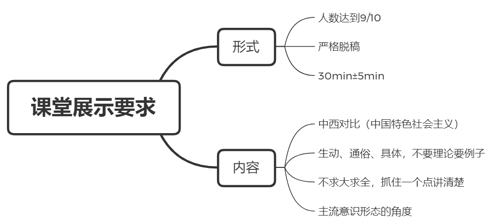

# 基本信息

杨晓斌
15966876268
Yangxiaobin611@sina.com

> 材料题两题：每题25分

期末考试上课序号 81 号

建议:

1. 持中立态度看意识形态（意识形态无好坏之分，只有适合不适合之分）
2. 用动态、发展的眼光

授课内容 | 展示主题 | 备注
-----|------|---
人是什么 | 对于社会发展来讲，集体人的必要性与优越性 | 理性，感性，实践
多样世界是否有统一本质 | 辩证分析经济发展与个人权利关系 | 让出利益获得发展
物质世界如何存在 | 科学是否是客观的 | 时间空间，运动
什么是马克思主义 | 中国特色社会主义的马克思主义本质 |
什么是哲学 | 意识形态教育的必要性 | 唯心主义，唯物主义
物质世界为何运动 | 中国为何不能照搬西方制度 | 总特征，矛盾规律
物质世界如何运动 | 梳理美国民主化与现代化发展史 | 量变到质变
如何认识世界 | 民主社会主义为何不属于社会主义，我国为何不能执行 | 否定之否定规律
什么是真理 | 历史虚无主义的错误及其成因 | 客观性，绝对性，相对性
如何认识人类社会历史 | 普世价值为何不可能 | 价值观霸权
人类社会历史有无规律 | 网络对于主流意识形态的双刃剑效应 |
谁人推动与创造历史 | 与总统制相比，人民代表大会制度的优势 |
何为资本主义制度本质 | 西方经济危机的本质与危害 | 政治经济学，资本论
如何看待当代资本主义新变化 | 资本主义与社会主义的借鉴 |
共产主义是否可能 | 共产主义理想的作用 |

> 讲的越快考的越少，不讲的都不考，所以整理笔记的时候注意一下。
